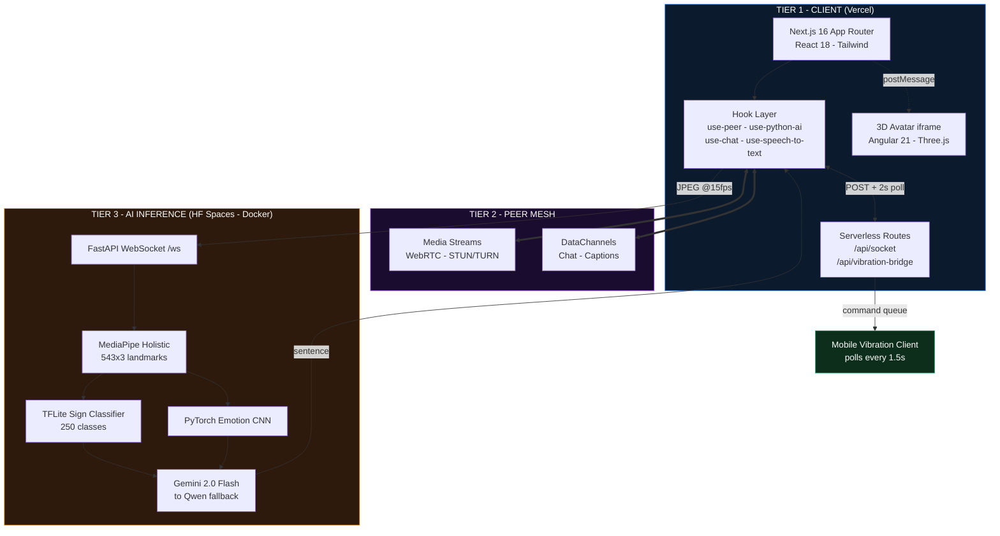

<div align="center">

# 🎙️ AccessAudio

A multimodal, accessibility-first conferencing platform where **sign language, facial emotion, speech, Morse code, and haptic vibration** are all first-class channels — translated between each other in real time by computer-vision models and an LLM.

[](https://nextjs.org/)
[](https://react.dev/)
[](https://fastapi.tiangolo.com/)
[](https://www.tensorflow.org/lite)
[](https://pytorch.org/)
[](https://developers.google.com/mediapipe)
[](https://peerjs.com/)
[](https://www.python.org/)

</div>

---

## 🌍 Why This Exists

Every mainstream conferencing tool — Zoom, Meet, Teams — is built on one silent assumption: **that all participants can hear and speak.** Captions are bolted on afterward, and they translate in exactly one direction: audio → text.

| Who | What breaks today | What AccessAudio does |
| :--- | :--- | :--- |
| **Deaf / hard-of-hearing** | Can see the call, can't hear it | Live captions from speech **+** a 3D avatar that signs incoming text |
| **Mute / non-verbal** | Can hear the call, can't respond | Signs recognized on camera, spoken aloud as natural sentences |
| **DeafBlind** | Excluded entirely — no audio, no visual channel | Speech transcoded to **Morse and delivered as phone vibrations** |
| **Motor-impaired** | Typing and signing may both be difficult | **Single-key Morse input** — the whole alphabet from one spacebar |

AccessAudio treats each of these as a **peer channel**, not an accessibility overlay. Any input modality can route to any output modality, in the same room, in real time.

> Accessibility isn't a feature you add to a video call. It's a **translation graph** between human communication modes — with an LLM at the center turning fragmented, grammatically-loose signals into fluent sentences.

---

## 🎛️ Communication Channels

| # | Channel | Dir | Technology |
| :-: | :--- | :-: | :--- |
| 1 | **HD video + audio** | ⇄ | WebRTC / PeerJS — full-mesh P2P, STUN + TURN fallback |
| 2 | **Sign language recognition** | → | MediaPipe Holistic + TFLite — 543 landmarks, 30-frame sequences |
| 3 | **Facial emotion detection** | → | MediaPipe FaceDetection + PyTorch CNN — 8 AffectNet classes |
| 4 | **Speech-to-text** | → | Web Speech API — continuous, interim results, auto-restart |
| 5 | **Morse code input** | → | Keying state machine: `SPACE` dot/dash · `c` commit · `s` space · `e` speak · `⏎` send |
| 6 | **3D signing avatar** | ← | Embedded Angular app (sign.mt), driven via `postMessage` |
| 7 | **Haptic vibration bridge** | ← | HTTP command queue + `navigator.vibrate` on a QR-paired phone |

Each channel is independently toggleable from the in-call control bar.

---

## 🏗️ Architecture

Three tiers, each on infrastructure suited to its workload.



| Tier | Host | Why |
| :--- | :--- | :--- |
| Frontend + signalling | Vercel | Global edge, zero-config Next.js |
| Media + chat | Peer-to-peer, no server | Lowest latency — and media never touches a server, a **privacy property** |
| AI inference | HF Spaces (Docker) | Needs persistent WebSockets + hundreds of MB of weights — impossible on serverless |

---

## 🔄 How Sign → Speech Works

1. **Capture** — browser draws the video to a `240×240` canvas, encodes JPEG at quality `0.4`, streams base64 over WebSocket at ~15 FPS.
2. **Landmarks** — MediaPipe Holistic reduces each frame to **543 × 3** points (468 face + 21 left hand + 33 pose + 21 right hand). Missing regions are `NaN`-filled.
3. **Classify** — a 30-frame rolling window feeds the TFLite `serving_default` signature runner over 250 classes. A word commits only when `confidence > 0.55` **and** two consecutive predictions agree **and** it isn't an immediate repeat — then an 0.8s cooldown fires.
4. **Emotion** — every 5th frame, FaceDetection crops the face (+20% padding), normalizes to `224×224`, and a PyTorch CNN predicts one of 8 AffectNet classes.
5. **Review** — the detected word buffer appears in the sender's UI with **Translate** and **Clear** buttons. *The LLM never fires automatically.*
6. **Translate** — on approval, words + emotion go to Gemini 2.0 Flash, which reconstructs a grammatical sentence carrying the signer's tone.
7. **Broadcast** — the result ships to peers over the WebRTC DataChannel, where it renders as a caption, plays via emotion-tuned TTS, animates the 3D avatar, or vibrates a paired phone.

**Why landmarks instead of pixels?** The classifier becomes invariant to lighting, skin tone, clothing, and background — and the model stays at 3.4 MB.

---

## 🛠️ Tech Stack

| Layer | Stack |
| :--- | :--- |
| **Frontend** | Next.js 16 (App Router) · React 18 · Tailwind CSS 3 · shadcn/ui · lucide-react · qrcode.react |
| **Real-time** | PeerJS 1.5 / WebRTC (unified-plan) · Google STUN + OpenRelay TURN · custom HTTP-polling signalling client |
| **AI / ML** | FastAPI 0.110 · uvicorn · MediaPipe Holistic 0.10 · TensorFlow Lite 2.15 · PyTorch 2.2 · OpenCV (headless) · NumPy |
| **LLM** | Google Gemini 2.0 Flash (primary) → `gemini-flash-latest` → OpenRouter Qwen (fallback chain) |
| **3D Avatar** | Angular 21 + Ionic + Three.js — vendored [sign.mt](https://sign.mt), served via Next.js rewrites |
| **Infra** | Vercel · Docker → 🤗 HF Spaces · GitHub Actions · Git LFS |

---

## 📁 Project Structure

```
Capstone_AccessAudio/
├── streamtalk/                     # Next.js frontend (Vercel deploy root)
│   ├── app/
│   │   ├── [roomId]/page.js        # ★ Call orchestrator — wires every modality
│   │   └── api/
│   │       ├── socket/             # Signalling: rooms, sessions, presence
│   │       ├── vibration-bridge/   # GET serves mobile client; POST enqueues haptics
│   │       └── proxy/sign-pose/    # CORS proxy to sign.mt pose service
│   ├── hooks/
│   │   ├── use-peer.js             # PeerJS lifecycle, health check, backoff
│   │   ├── use-python-ai.js        # ★ WS bridge to ML backend + backpressure
│   │   ├── use-chat.js             # DataChannel mesh: chat + captions + heartbeat
│   │   └── use-speech-to-text.js   # Web Speech API
│   ├── components/ui/              # Captions, controls, Morse, vibration wizard
│   ├── store/socket.js             # ★ APISocket — polling signalling client
│   └── next.config.js              # COOP/COEP headers, avatar asset rewrites
│
├── ml/                             # Python inference backend
│   ├── streamtalk_backend.py       # ★ FastAPI WS server: CV → LLM → response
│   ├── models/model.tflite         # Sign classifier (3.4 MB, 250 classes)
│   ├── model_config_emotion/       # AffectNet CNN: configs, architectures, weights
│   ├── label_map.json              # 61-word Indian Sign Language vocabulary
│   └── unified_pipeline*.py        # Offline research pipelines (v1 → v3 TFLite)
│
├── avatar/translate/               # Vendored sign.mt Angular source
├── Dockerfile                      # Python 3.10-slim → HF Space, non-root, :7860
└── .github/workflows/hf_sync.yml   # CI: main → HF Space with LFS migration
```

---

## 🚀 Getting Started

**Prerequisites:** Node.js ≥ 18 · Python 3.10.13 (pinned — MediaPipe is version-sensitive) · Git LFS · a [Google AI Studio](https://aistudio.google.com/) key.

```bash
git clone https://github.com/AdityaNair04/AccessAudio.git
cd AccessAudio
git lfs install && git lfs pull
```

### 1 — ML backend

```bash
python -m venv ai_env
.\ai_env\Scripts\activate        # Windows
source ai_env/bin/activate       # macOS / Linux

pip install -r ml/requirements.txt
```

Create `ml/.env`:

```env
GEMINI_API_KEY=your_google_ai_studio_key
OPENROUTER_API_KEY=your_openrouter_key   # optional fallback
```

```bash
python ml/streamtalk_backend.py
# Models Ready on ws://localhost:8000/ws
```

### 2 — Frontend

```bash
cd streamtalk
npm install
npm run dev        # http://localhost:3000
```

### 3 — Try it

Open `http://localhost:3000` → **Create New Room** → copy the URL into a second tab or device. Toggle channels from the floating control bar: 🎤 audio · 📹 video · 💬 speech captions · 🤖 3D avatar · ⌨️ Morse · 📱 vibration bridge.

> Sign-language AI activates only when **2+ users are in the room** and speech-to-text is off — the two are mutually exclusive by design.

**Standalone ML demos:** `python ml/webcam_sign.py` · `ml/webcam_emotion.py` · `ml/unified_pipeline_v3_tflite.py`

---

## ⚙️ Configuration

| Variable | Where | Required | Purpose |
| :--- | :--- | :-: | :--- |
| `GEMINI_API_KEY` | `ml/.env` | ✅ | Primary LLM |
| `OPENROUTER_API_KEY` | `ml/.env` | ➖ | Fallback when Gemini rate-limits |
| `NEXT_PUBLIC_AI_WS_URL` | `streamtalk/.env.local` | ➖ | Override the ML WebSocket endpoint |

When unset, the endpoint resolves automatically: `ws://localhost:8000/ws` in dev, the deployed HF Space in production. All `.env*` files are gitignored — **never commit API keys.**

---

## 🌐 Deployment

| Component | Host | Config |
| :--- | :--- | :--- |
| **Frontend** | Vercel | Root directory `streamtalk`, build `npm run build` |
| **ML backend** | 🤗 HF Spaces | Root `Dockerfile` — Python 3.10-slim, non-root uid 1000, CPU-only Torch wheels, uvicorn on `0.0.0.0:7860` |

`.github/workflows/hf_sync.yml` runs on every push to `main`: checkout with LFS → drop the stale `avatar/translate` submodule ref → `git lfs migrate import` across full history (satisfying HF's binary-file policy) → force-push to the Space. Set API keys as **Space secrets**, never in the image.

> ⚠️ The YAML frontmatter at the top of this README **is the Hugging Face Space config** (`sdk: docker`, `app_port: 7860`). The sync workflow pushes this file to the Space — removing those lines breaks the deployment.

---

## 📊 Key Engineering Decisions

| Decision | Implementation | Why it matters |
| :--- | :--- | :--- |
| **TCP backpressure gating** | Skip the frame entirely if `ws.bufferedAmount >= 16 KB` | The socket's own send queue becomes the flow-control signal. Frames are **dropped, never queued** — latency stays bounded on slow links instead of degrading unboundedly |
| **Epoch-based cancellation** | Every Translate/Clear increments a monotonic counter; stale-epoch payloads are dropped on arrival | A slow in-flight inference can never overwrite fresh UI state |
| **Human-in-the-loop LLM** | Translation fires only on explicit user approval | The system never puts words in a user's mouth — a hard requirement for assistive tools |
| **Double-confirmation + cooldown** | 2 consecutive identical predictions, then 0.8s refractory | Eliminates the flickering-duplicate problem of naive frame-by-frame classifiers |
| **Three-stage LLM fallback** | Gemini 2.0 Flash → `gemini-flash-latest` → OpenRouter Qwen | Survives rate limits and quota exhaustion; the UI always unlocks, even on total LLM failure |
| **Polling signalling shim** | `APISocket` mirrors the `socket.io` API over `POST` + 2s `GET` polling | Vercel functions are request-scoped and can't hold WebSockets — this avoids a separate always-on server |
| **Zero-install haptic bridge** | One `GET` returns a complete self-contained HTML client; QR code pairs the phone | No app store, no USB tethering, no typing a URL |
| **Layered WebRTC recovery** | 3s peer health check · 5s call timeout · linear backoff · `isReconnecting` state | Peers survive real mobile networks without flickering in and out of the grid |

**Tuning reference:** 240×240 frames @ q0.4 · ~15 FPS (66 ms) · 30-frame sequence · sign confidence `> 0.55` · emotion sampled every 5th frame at confidence `> 0.3` · 2s signalling poll · 1.5s haptic poll · 5 min session TTL. Models load **once at process start**; blocking CV and LLM calls run via `asyncio.to_thread` / `run_in_executor` so the event loop never stalls.

---

## ⚠️ Known Limitations & Roadmap

| Limitation | Impact | Planned fix |
| :--- | :--- | :--- |
| Room state is an in-memory `Map` | Doesn't survive cold starts or multiple instances | Redis / Vercel KV |
| Polling signalling (~2s) | Presence latency | Dedicated WebSocket service |
| Full-mesh P2P | O(n²) connections; ceiling ~4–6 peers | SFU (mediasoup / LiveKit) |
| `allow_origins=["*"]` on the ML backend | Fine for a demo, not production | Origin allowlist + WS auth token |
| Free-tier CPU inference | Cold starts, higher latency under load | GPU Space or ONNX / quantized weights |
| Fixed vocabulary | 250 ASL classes + 61 ISL words | Expanded ISL training; continuous-signing models |
| Sign and speech mutually exclusive | Can't caption voice and signs at once | Independent parallel pipelines |
| English-only | STT, prompt, and TTS assume `en-US` | Multilingual STT + prompt localization |

---

## 🙏 Acknowledgements

| Project | Used for | License |
| :--- | :--- | :--- |
| **[sign.mt](https://sign.mt)** ([sign/translate](https://github.com/sign/translate)) | 3D signing avatar + pose generation, vendored in `avatar/translate` | CC BY-NC-SA 4.0 |
| **[jamesjbustos/sign-language-recognition](https://github.com/jamesjbustos/sign-language-recognition)** | The ASL TFLite classifier. Per upstream: LSTM + Transformer, ~250 signs, Google ASL Kaggle dataset (~100k videos), **reported** 87% accuracy | See upstream |
| **[marufk21/streamtalk](https://github.com/marufk21/streamtalk)** | Original WebRTC video-call foundation | MIT |
| **[AffectNet](http://mohammadmahoor.com/affectnet/)** | Training data for the 8-class emotion CNN | Research use |
| **[MediaPipe](https://developers.google.com/mediapipe)** · **[PeerJS](https://peerjs.com)** · **[OpenRelay](https://www.metered.ca/tools/openrelay/)** | Landmarks · WebRTC · TURN relays | Apache 2.0 / MIT |

> Accuracy figures for the vendored ASL model are **as reported upstream** and have not been independently re-benchmarked here.

---

## 📄 License

⚠️ **No `LICENSE` file is present yet.** Without one, default copyright applies and others cannot legally reuse the code.

Note that **`avatar/translate` (sign.mt) is CC BY-NC-SA 4.0** — non-commercial and share-alike. If the avatar stays vendored in-tree, the project's terms must be compatible. Options: MIT for original code plus a `NOTICE` for third-party terms · CC BY-NC-SA 4.0 for the whole repo · or drop `avatar/translate` and load sign.mt externally.

---

<div align="center">

### Built so nobody has to sit out the conversation.

<sub><a href="https://github.com/AdityaNair04/AccessAudio">github.com/AdityaNair04/AccessAudio</a></sub>

</div>
